 

# Kantar2013

Teknik Analiz ve Geliştirme Dökumanı

| **Hazırlayan** | Hasan YILDIRIM ( SAP/NET Danışmanı ) |
|----------------|--------------------------------------|
| **Email**      | HasanYildirim@hotmail.com            |
| **Yer**        | Kadıköy / İSTANBUL                   |
| **Tarih**      | 23.Mayıs.2014                        |
| **Version**    | v1.0                                 |

## [1] Programın Amacı :

Celik firmasının muhendisleri, kullanıcılari ve teknik ekibi
tarafindan ortaklaşa hazırlanan bu projenin amacı, 7/24 calisan kantar
ofisinin SAP sistemi ile entegre calısmasidir. Projenin gelisiminde onceden
yazılmis uygulamalar detaylica incelenip, yeni bir platform olusturulmustur.

## [2] Programın Geliştirilmesinde Kullanilan Yazılım Teknolojileri :

    | Gelistirme Ortami | : Microsoft Visual Studio 2010 Ultimate |
    |-------------------|-----------------------------------------|
    | Gelistirme Dili   | : Visual C# 4.0                         |
    | NET Framework     | : Version 4.0                           |
    | ORM               | : MS Entity Framework v5.0              |
    | Database          | : MS SQL Server 2012 Express            |
    | Serial Comm.      | : MS NET Framwork Library               |
    | Visual Comps.     | : DevExpress v12.2.8                    |
    | SAP Interface     | : SOA Manager                           |

Programın gelistirilmesinde temel olarak Microsoft urunleri kullanılmış
olup, SAP ile entegrasyonu SAP SOAManager uzerinden gerceklestirilmistir…
İlerleyen bolumlerde bu servis tanımlarinin detaylari verilecektir..

Uygulama cift sistem calistigi icin, lokal verilerinin ayrica saklanabilmesi
icin masaustu bir veritabani sistemi ile desteklenmistir. Butun tartimlar,
hep SAP tarafinda hemde local veritabani olan SQL Server tarafinda guvenlik
geregi saklanmistir… Ayrica, olasi bir veri kaybi senaryosunda, cift tarafli
DATA TRANSFER MODULU gelistirilmistir… Bu konuda documanda ayrica detayli
olarak incelenecektir…

Programda destekleyeci komponent olarak, DevExpress firmasinin lisansli
gorsel komponent paketi kullanılmistir… Ozellikle grid ve raporlama
adimlarinda, bu komponentler kullacilarin farkli taleplerinin
gerceklestirilmesini kolaylastirmistir...

## [3] Programın Veri Modeli :

Programda Data Erişim Katmanı olarak Microsoft un EntityFramework
teknolojisi LINQ diliyle beraber kullanılmistır.. Hazirlanan genis bir
kutuphane ile her turlu veri isleme ( Kayit Ekleme / Silme / Guncelleme vs )
adımlari tekbir arayuzden gerceklestirilmistir..

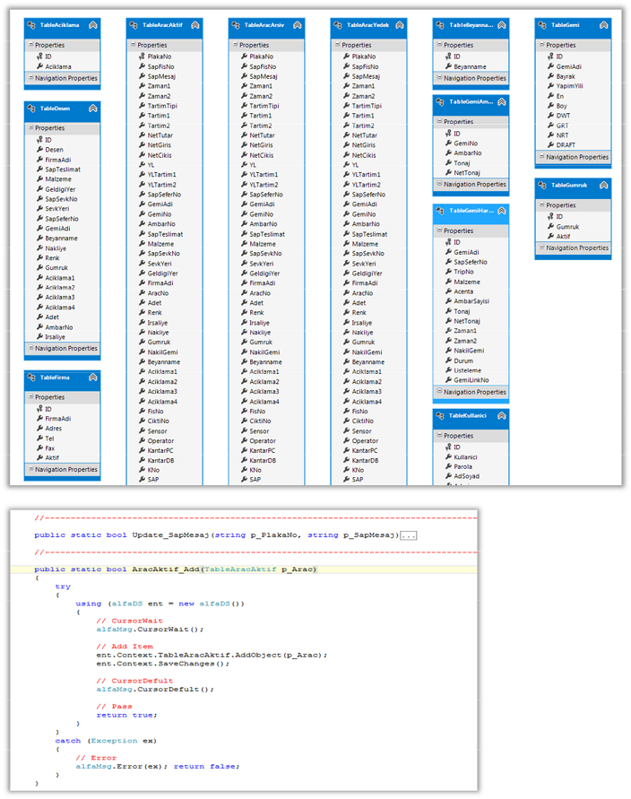

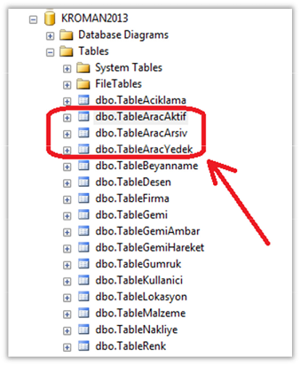

Uygulamanin SQL Server tarafinda kulanilan tablolarin gorunumu yandaki
semadaki gibidir. Burada bazi kritik tablolari deginmek gerekirse,

-   TableAracAktif : Tartim esnasinda birinici tartimini yapip, fabrika
    icinde yuk alimi icin bulunan araclarin bilgisini icerir.

-   TableAracArsiv : Ikinci tartiminida tamamlayip, artik fabrikayi
    terkedecek araclarin butun tartim detay kayitlarini icerir. Bu tabloda
    Tartim1 ve Tartim2 degerleri kullanilarak net hesaplamalar yapilir, yuk
    alimi veya yuk birakilma detaylari raporlarda olusturulur.

-   TableAracYedek : Bu tablo, yukarda iki tablo gibi ayni desene sahip
    olup, kayitlar uzerinde herhangi bir islem yapildiginde kayitlarin degisim
    tarihcesini tutar. Boylece geriye donuk sorgulamarda detayli bilgilerin elde
    edilmesini saglar.

Uygulama ayni zamanda Liman İşletmesinin sureclerinide icerdigi icin, sadece
liman modulunde kullanılan tablolar da mevcuttur. Bu tablolar isimleri su
sekildedir:

Liman Tabloları : TableGemi / TableGemiAmbar / TableGemiHareket / TableGumruk.

## [4] Uygulamanın Çalışma Modları :

İşletmede kullanılan onceki uygulamardan farklı olarak, her bir sureç icin
ayri bir program kullanılmamistir… Butun moduller, tek bir proje altinda
toplanmistir. Bu nedenle uygulama :

-   Kullanici Bazinda ( ADMIN / OPERATOR )
-   Lokasyon Bazinda ( MERKEZ / LIMAN )

Farklı modlarda calismaktadir…

Uygulama kullanicilarin admin profilinde veya normal profilde calisip,
calismayacagini, programin ayarlar sayfasinda secebiliyoruz… Normal operator
kullanicilari ici admin yetkisinin verilmemeisini oneriyoruz.

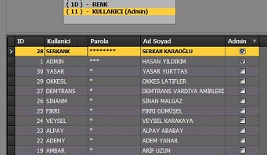

Programın lokasyon bazinda farklı calismasi icin, uygulamanin config
dosyasinda calisacagi lokasyonu belirliyoruz. Bu tur degisimleri sadece
gorevli IT personeli tarafindan yapilmasini oneriyoruz…

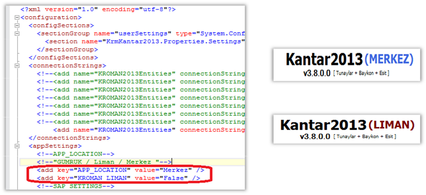

## [5] Uygulamanın Configurasyon Dosyası :

Uygulama exe si ile ayni dizin altinda “KrmKantar2013.exe.Config” ismi
ile yer alan bu dosya cok kiritik bilgiler icermektedir..

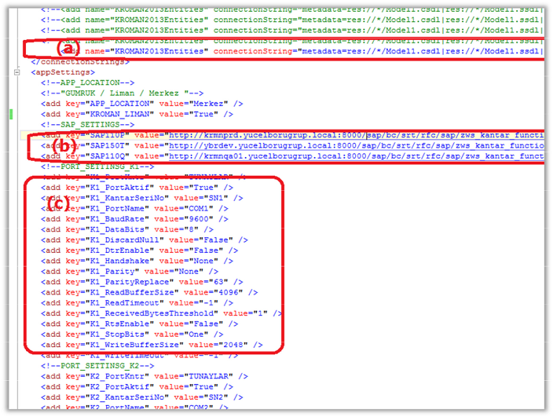

Butun SAP Server ayarlari, SQL Server baglanti bigileri, SeriPort
parametreleri, Sensor bilgileri, lokasyon bilgileri kisacasi butun onemli
degerler bu dosya icinde saklanmaktadir.

1.  SQL Server baglanti bilgileri, adres, kullanici, sifre, vs…
2.  SAP Server bilgileri TEST / CALI / QA sisteminin web server bilgileri
3.  Kantar sistemini bagli bulundugu PORT1 ve PORT2 bilgileri
4.  Sensorlerin bagli bulundugu port ve bilgileri

Uygulama ayni zamanda test muhendisleri tarafindan test amaclida
kullanildigi icin, bu dosyada yapilan configurasyon degisikiligi ile CANLI
sistemden TEST sistemine baglanti yapmak mumkundur…

Dikkat: Uygulama ile test tartımlar yapılırken mutlaka ve mutlaka hem
SQL server hemde SAP server tarafinda CANLI sistemin olmadigindan emin olmaliyiz.

## [6] Uygulamanın Arayüzü :

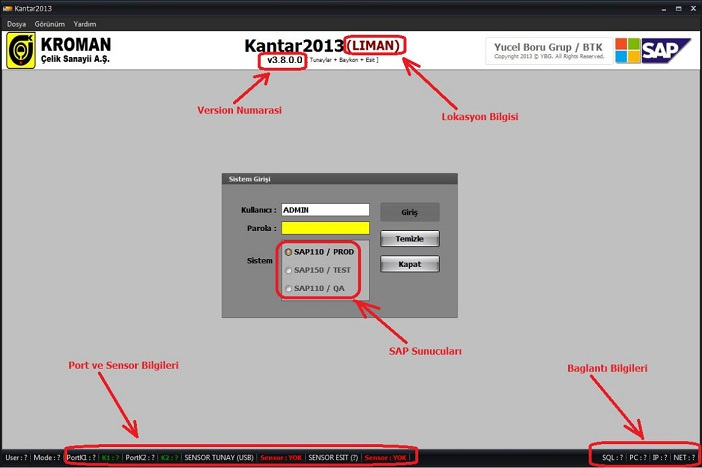

Uygulamani Sistem Giris sayfasinda karsilacagimiz onemli detaylar yukarda
belirtilmistir. Ozellikle status barda yer alan bilgiler, hem kullanicilar
icin hemde teknik personel icin onemli detaylar icermektedir…

**(*) SQL Server Degisimi**

Ornegin, bagli bulunan SQL Server in adresini degistirmek icin SQL yazili
alana cift tiklamamiz yeterli olacaktir…

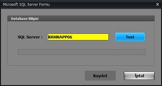

Gelen popup ekranda yeni hedef suncu adresi IP olarak veya isim olarak
girilebilir. Giristen sonra TEST tusuna basarak server in gercekligi test
edilebilir. Daha sonra kaydettigimiz server, her zaman gecerli olacak adres
olacaktir.

**(*) Kullanıcı Sifre Degisimi**

Ayni islemi, kullanici sifre degistirme surecinde de yapabiliriz… Kullanici
ismini cift tıkladigimizda acilan pencere sifre degisimini
gerceklestirebiliriz.

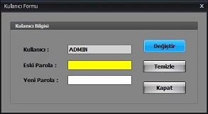

**(*) Port ve Sensor Ayarları**

Uygulamaya baglı bulunan kantar indicatorlarinin tipini, port ayarlarini,
sensor secimini asagidaki ekran yapabilir ve ayni zamanda testte
edebilirsiniz..

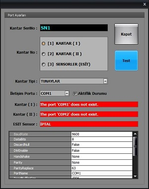

## [ Kantar Tartım Penceresi ]

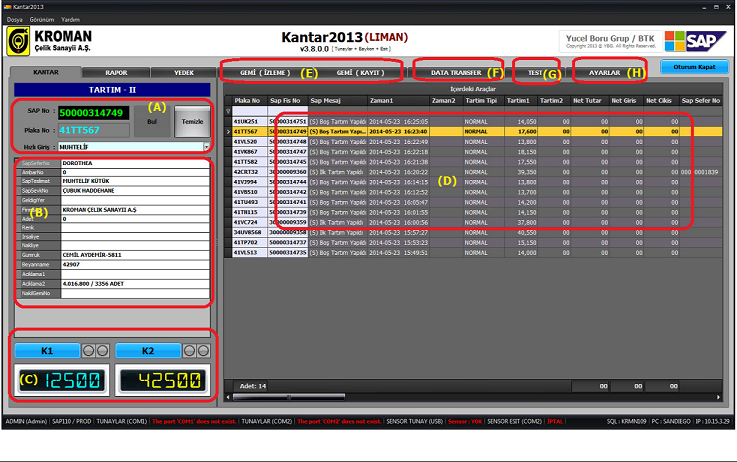

1.  Tartım icin gelen aracin kaydit bulma seklmesi ( PlakaNo veya SAP No ile)
2.  Bulunan tartım kaydının giriliebilir alanlari (Bu alanlar lokasyona gore degismektedir)
3.  Uygulamaya bagli kantarlarin agirlik bilgisi ve tartım butonları
4.  Fabrika icinde bulunan araclarin bilgisi, sadece Tartim1 surecini tamamlamis kayitlar.
5.  Gemi İzleme ve Gemi kayit ekranlari ( Detayli olarak incelenecektir )
6.  Port test ekrani. Bagli bulunan kantar arasinda veri transferini test eder.

**(*) Kantar Fisi**

Tartim1 yapilmis veya Tartim2 si tamamlanmis bir kaydin fisini direk olarak
menu sistemini kullanarak basabiliriz… Kantar Fisindede Text mod ve grafik
mod olmak uzere 2 adet secenegimiz bulunmaktadir..

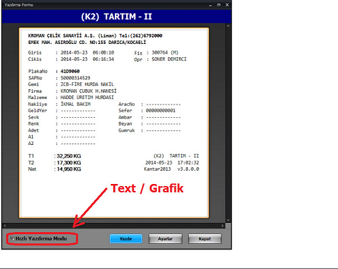

## [7] Uygulamanın Kurulumu :

Uygulama, Windows client uzerinde .Net Framework v4.0 olan her makinada
sorunsuz bir sekilde calisabilir. Ayrica uygulumanin kantar indicatorlerine
ve sensorlere baglanmasi icin PC uzerinde Serial COM portlarin bulunmasi
gerekmektedir. Iletisim portlar uzerinden saglanmaktadir.

Uygulamanin calismasi icin gerekli olan dosyalar asagidaki gibidir:

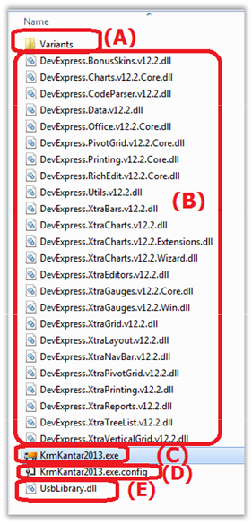

1.  Uygulamanin kullanici bazli variant ayarlarinin saklı oldugu dizindir.
2.  DevExpress komponent kutuphanesinin dosyalaridir. Uygulamanin calismasi icin gereklidir.
3.  Uygulamanin kendi .net EXE sidir.
4.  Uygulamanin configurasyon dosyasi, butun parametreler bu dosya icinde yer almaktadir.
5.  Uygulamanin USB portlara ersimini saglayan kutuphanedir.

## [8] Veritabanin Yedeklenmesi :

Kantar uygulamasi, her kantar ofisinde ayri ayri veritabani sunucusu
bulundurdugu icin yedeklenme sureci cok onem arz etmektedir. Herhangi bir
kriz aninda, ilgili lokasyonunun yedek veritabani dosyasindan geri donusum
yapmak mumkundur. Geriye yonelik 12 satlik surec icinde her saat basi
otomatik yedekleme procesisi calismaktadir.. Boylece farkli saatlerdeki
verilar, ayri ayri tutulabilmektedir. Yedekleme hem local olarak hemde
remote server olarak geceklesmektedir.

**Yedekleme sureci nasil yapılmaktadır ?**

Oncelikle Kantar server uzerinde backup programi yuklu degilse, programi
linkinden indirip kuruyoruz:

**http://sqlbackupandftp.com/**

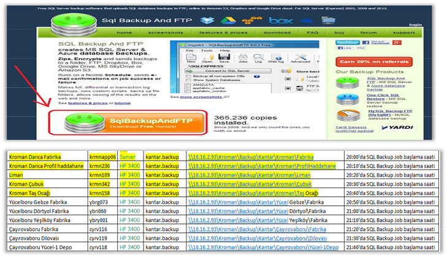

Kurulum bittikten sonra backup configurasyonuna baslayabiliriz…

Configurasyon, temelde 4 adimdan olusuyor…

**I-)** SQL Server ayarlarinin yapilmasi
**II-)** Backup dosyasinin atilacagi hedef alanin belirlenmesi
**III-)** Gerekiyorsa Email bildirim ayarlarinin yapilmasi
**IV-)** Yedeklemenin hangi saat ve zaman aralliginda calismasinin
planlanmasi

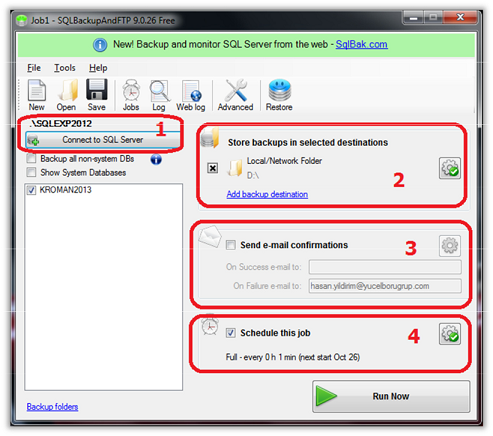

1.  **SQL Server Ayarlari**

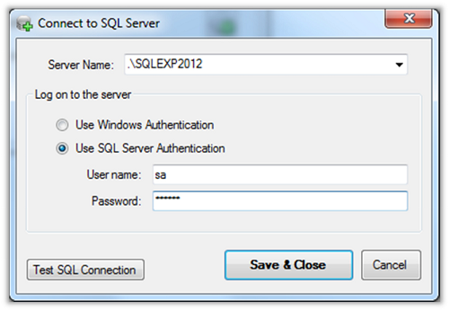

Backup icin baglanacagimiz SQL server in adresini baglanti bilgileri
girmemiz gerekiyor.. Bu noktada asagidaki kullanici adi ve sifreleri
kullanabilirsiniz.

user: sa
pass: XXXXX

1.  **Backup dosyasinin atilacagi hedef alanin belirlenmesi**

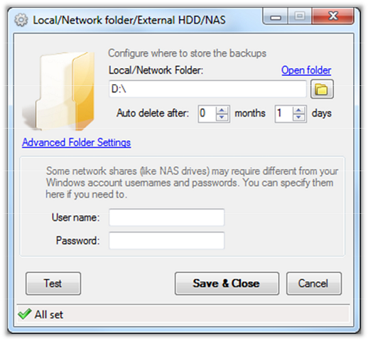

Burda backup dosyasini atacagimiz yeri belirliyoruz… Eger lokasyon remote ve
network uzerinde ise map edilmis network drive **kullanmamaya** ve
ayarlardan sonra TEST butonu ile test ederek kullanici sifre hatalarinin
olmadigina dikkat etmeliyiz…

Kullanmamiz gereken baglanti bilgileri asagidadir…

**User: grupkantar.backup**
**Pass: XXXXXX**

1.  **Email Bildirim Ayarlari**

Email bildirim ayarlarinida asagida goruldugu gibi ayarliyoruz…
SMTP: 10.16.2.84:25
From: *Kantar_Backup\@borugrup.com*
sent: *BTK\@borugrup.com*

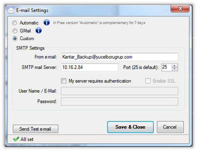

## [IV] Shedule ayarlarinin yapilmasi…**

Son olarak, backup hangi saat, gun ve zaman araliginda yapilacagini
configure ediyoruz….

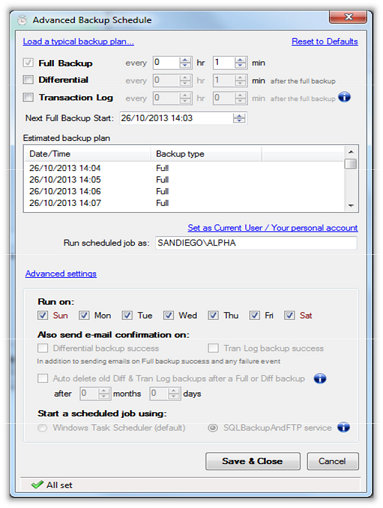

Butun bu islemler bittiginde yaptigimiz backup isini kayit ediyoruz….
Boylece islem tamamlaniyor…

## [9] Veritabanin Geri Yüklemesi :

1.  Serveri uzaktan erisim saglandiktan sonra SqlBackupAndFTP programina ait

**One-Click SQL Restore** programi acilir…

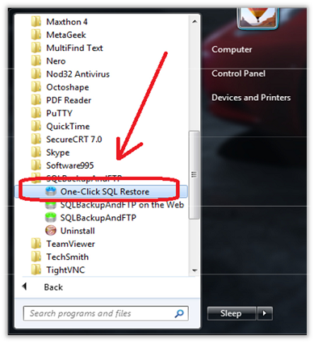

1.  Daha sonra acilan restore ekraninda 3 adet onemli bilginin kontrol edilmesi gerekmektedir…

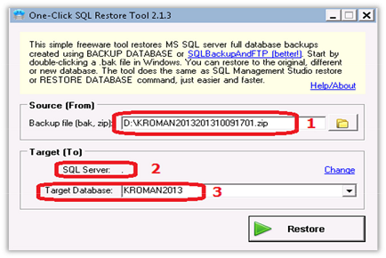

Birinci olarak restore icin kullanacagimiz dosyayi sececegiz. Dosya zip
formatinda olup, uygulama tarafindan desteklenmektedi. Zipli dosyayi direk
gosterebilirsiniz…

Ikinci olarak Restore edilen hedef Server ismini kontrol etmeliyiz. Yanlis
bir serveri islem yapilmamalidir… Asagida goruldugu uzere server ismi (.)
nokta olarak gorunmekte yani local makina uzerinde bulunan sql server
kasdedilmektedir...

Ucuncu ve son islem olarak Database ismini kontrol ediyoruz. Daha sonra
restore deyip, islemi baslatiyoruz. Veritabani cok ufak oldugu icin cok kisa
bir sure icinde islem tamamlaniyor…

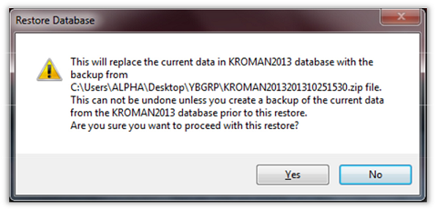

## [10] Data Transfer Modulu :

Dokumanin basindada bahsedildigi uzere, uygulama icindeki en kritik
modullerden bir taneside data transfer moduludur. Bu modul sayesinde SAP ve
SQL sunucular arasinda cift yonlu veri transferi yapilarak eksik kalan ve
veya kaybolan veriler tamamlanir. Bu surec, sadece ve sadece SQL yedekleme
sistemi calismadiginda onerilir. Kontrollu bir sekilde ve ilgili uzman
tarafindan calistirilmasi cok onemlidir. Yanlislikla farkli sunucular
arasinda yapilacak bir transfer, veri kaybina neden olabilir. Bu modulde,
sunucular arasindaki farkli veri tipleri icin donusum fonksiyonlari
yazilmistir. Boylece datani kopyalanmasinda hata olusumu engellenilmistir…

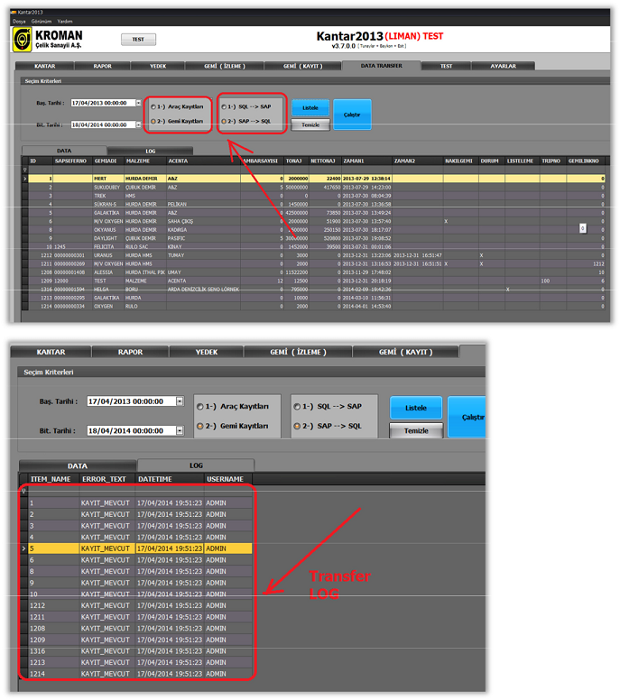

## [11] Liman Modulu :

Uygulamada en cok yer kaplayan ve surecli en detayli olan modul, liman
moduludur. Bu modul sayesinde limana gelen butun gemilerin yukleme ve
bosaltma surecleri kantar sisteminden takip edilmekte ve gerekli mudaheleler
yapilabilmektedir. Ayrica gemi veritabani, isletmedeki diger fabrika
sevkiyat uzmanlari tarafincada takip edilmektedir. Bu anlamda canli veriye
ulasmak ve gerekli raporlari elde edebilmek onemlidir.

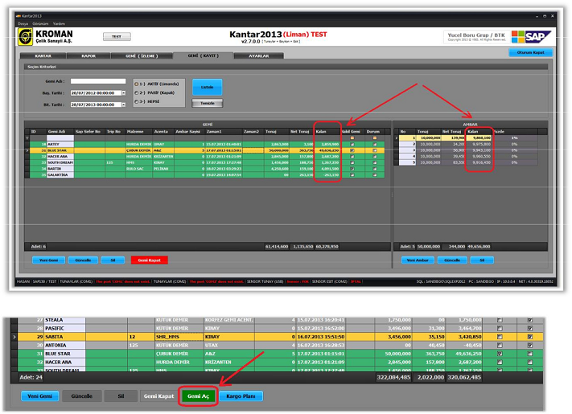

Yukleme ve bosaltma sureclerinde, gemilerin ambar bilgileri ayrica
tutulmaktadir. Islemi tamamlanan gemi kapama surecine tabi olup, artik islem
yapilmasi engellendir.

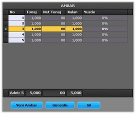

## [12] Raporlar ve Çıktılar :

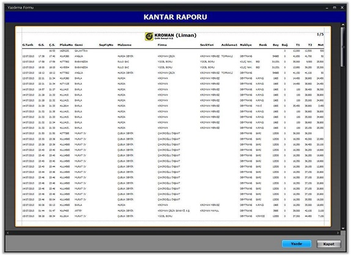

Uygulamada hem Liman modu hemde Merkez modu icin farkli rapor desenleri
alınabilmektedir. Ayrica sistemden cekilen butun raporlari disari Microsoft
Excel formatinda saklamak mumkumdur.

Ana uygulamaya destekleyici rapor uygulamarida gelistirilmistir. Bunlardan
KantarRapor2013 sayesinde butun lokasyon verileri gorulebilmektedir.

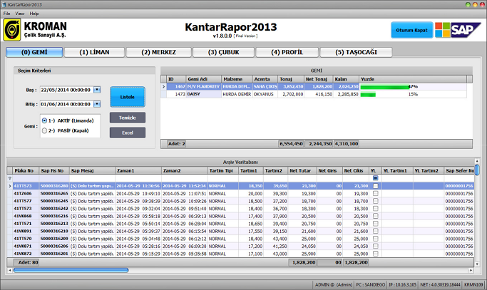